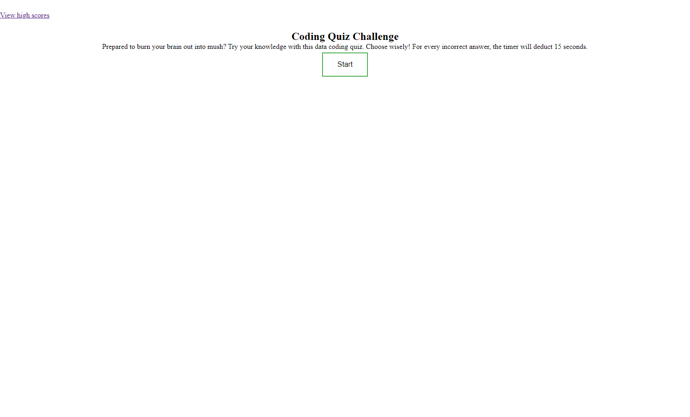

# time-quiz

## Description

I started this project with the hope that I could pass on the amateur know-how I've learned so far using Javascript. Over the course of the past week, I tried to built this timed quiz from scratch. Some of the things I've learned how to do through this endeavor are how to implement a timer with a set decrement, properly match an event listener with the necessary conditional statements, and I've also learned that trying to be creative with variable names really did help perk my interest up with writing my code. I hope that they resonate with any other devs who come upon this amateur project. Towards the end of this project, I did have trouble with my score sheet and linking the local storage as well as the separate high score page. But I hope with more time and repetitive learning and googling, I can find the answer and add features to this project in the future.

## Usage

https://valeriereds.github.io/time-quiz/

## License

MIT License

Copyright (c) [2023] [ValerieRojas]

Permission is hereby granted, free of charge, to any person obtaining a copy
of this software and associated documentation files (the "Software"), to deal
in the Software without restriction, including without limitation the rights
to use, copy, modify, merge, publish, distribute, sublicense, and/or sell
copies of the Software, and to permit persons to whom the Software is
furnished to do so, subject to the following conditions:

The above copyright notice and this permission notice shall be included in all
copies or substantial portions of the Software.

THE SOFTWARE IS PROVIDED "AS IS", WITHOUT WARRANTY OF ANY KIND, EXPRESS OR
IMPLIED, INCLUDING BUT NOT LIMITED TO THE WARRANTIES OF MERCHANTABILITY,
FITNESS FOR A PARTICULAR PURPOSE AND NONINFRINGEMENT. IN NO EVENT SHALL THE
AUTHORS OR COPYRIGHT HOLDERS BE LIABLE FOR ANY CLAIM, DAMAGES OR OTHER
LIABILITY, WHETHER IN AN ACTION OF CONTRACT, TORT OR OTHERWISE, ARISING FROM,
OUT OF OR IN CONNECTION WITH THE SOFTWARE OR THE USE OR OTHER DEALINGS IN THE
SOFTWARE.